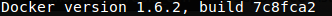

# Mi primer contenedor

En este documento se dará una breve introducción a Docker y a su vez se guiara en la creación de un contendor.

## ¿Qué es Docker?

Docker es un proyecto de código abierto que automatiza el despliegue de aplicaciones dentro de contenedores.

### ¿Contenedores?

La virtualización basada en contenedores es un tipo de virtualización que se da a nivel de sistema operativo, donde múltiples sistemas Linux (Contenedores) pueden correr aisladamente sobre un único anfitrión.

Cada contendor esta altamente aislado, posee su propia red y sus propias stacks de almacenamiento.

### Maquinas virtuales y Docker

Imaginemos que realizamos una aplicación web y queremos ponerla en producción.

Si deseamos usar una maquina virtual necesitaríamos incluir dentro de ella la aplicación y las depencias de esta para que pueda funcionar y un sistema operativo completo. Además de una capa de hipervisor donde simulemos los recursos de hardware para cada maquina virtual.


Los contenedores incluirán la aplicación y todas sus dependencias, pero compartirán el kernel con otros contenedores. Ellos correran aisladamente como un proceso en el sistema anfitrión. Los contenedores de Docker no están atados a alguna infraestructura especifica ellos pueden correr en cualquier computadora.


### Componentes de Docker

#### Imágenes

En Docker cada contenedor es creado en base a una imagen. Una imagen es una plantilla que representa a un contenedor y es de solo lectura. Por ejemplo, una imagen puede contener un sistema operativo Ubuntu instalado con Nginx y una aplicación web instalada.

#### Registro

Los registros de Docker sirven para almacenar imágenes. Estos pueden ser públicos o privados y permiten almacenar o descargar imágenes. Docker provee un registro publico (Docker Hub) del cual podemos obtener distintas imágenes y lo puedes ver [aquí](https://hub.docker.com/).

#### Contenedores

Un contenedor de Docker es una instancia de una imagen, este contiene todo lo necesario para correr una aplicación. Los contenedores de Docker pueden ser iniciados, detenidos, trasladados o eliminados.

## Mi primer contenedor

Para dejar claro el para que y como de Docker vamos a crear un contendor con una aplicación web dentro.

### Instalando Docker

Existen distintas formas de instalar Docker y todas varían dependiendo del sistema operativo. Puedes consultar como instalar Docker en tu computadora [aquí](https://docs.docker.com/installation/).

Para verificar la instalación de Docker puedes ejecutar el siguiente comando desde tu consola.

```
docker --version
```
Esto debera mostrarte algo como esto:



Es momento de crear nuestra primer imagen de Docker.

### Commit y Dockerfile

Existen dos formas de generar imágenes en Docker:

- Mediante el comando **commit**.
- Mediante el comando **build** y un archivo **Dockerfile**.

Dado que el metodo mas recomendado para crear imágenes es mediante el uso de un Dockerfile, en este texto no abordaremos el comando **commit**. Si quieres ver mas información sobre el comando **commit** puedes leer mas de el [aquí](https://docs.docker.com/reference/commandline/commit/) y ver un ejemplo [aquí](http://www.liquidweb.com/kb/how-to-commit-changes-to-docker/).

### Dockerfile

El archivo Dockerfile funciona mediante un sencillo [DSL](https://es.wikipedia.org/wiki/Lenguaje_espec%C3%ADfico_del_dominio) con instrucciones para la creación de imágenes. Una vez que se tiene un archivo Dockerfile listo se utiliza el comando **build** para construir una nueva imagen basada en el Dockerfile.

Es momento de crear nuestro primer Dockerfile, para eso crearemos un directorio que contendra nuestro archivo. Este directorio sera nuestro ambiente de construcción, en Docker es conocido como contexto o contexto de construcción. Nuestra construcción tendra acceso a cualquier archivo o directorio en el contexto de construcción, de esta manera podremos incluirlos dentro de nuestra imagen.

```
mkdir my-first-container
cd my-first-container
touch Dockerfile
```

Con estos comandos tendremos ya listo un contexto de construcción y un Dockerfile vacio. Ahora llenaremos este archivo con la información necesaria para crear nuestro contenedor.


*Dockerfile*
```
FROM ubuntu
MAINTAINER Marco Sanchez
RUN apt-get update
RUN apt-get install -y nginx
RUN echo "Hola, de Karma ;)." > /usr/share/nginx/html/index.html
EXPOSE 80
```

El archivo Dockerfile contiene instrucciones pareadas con argumentos. Cada instrucción debe estar escrita en mayúsculas, por ejemplo **FROM** y esta seguido por un argumento por ejemplo **ubuntu**.

Un Dockerfile siempre empieza con la instrucción **FROM** la cual especifica una imagen base existente. En este caso estamos usando la imagen de ubuntu que se encuentra en el docker hub.

En seguida especificamos al encargado de la imagen por medio de la instrucción **MAINTEINER**.

Proseguimos con tres instrucciones **RUN**. Esta instrucción ejecuta comandos en la imagen actual. En este ejemplo:

- Actualiza los repositorios del sistema de gestión de paquetes APT.
- Instalamos Nginx.
- Y creamos el archivo /usr/share/nginx/html/index.html con algo de texto.

Finalmente terminamos con la instrucción **EXPOSE** con esto le indicamos a Docker que la aplicación en este contenedor estara usando este puerto en el contenedor. Por cuestiones de seguridad Docker no brinda acceso automático, el espera a que este sea otorgado al momento de crear el contenedor por medio del comando **run**.

Existes muchas mas instrucciones que podemos usar, [este](https://docs.docker.com/reference/builder/) es un buen lugar donde leer sobre esto.

### Construyendo mi primer imagen

Para crear nuestra primer imagen basta con ubicarnos dentro del ambiente de construcción y ejecutar el comando build.
```
docker build -t "my-first-container" .

```

Con esto indicamos que nuestra imagen resultante sera nombrada **my-first-container**. Veras algo asi:


Con esto tenemos nuestra primer imagen creada. Para poder ver información sobre ella podemos ejecutar.

```
docker images my-first-container
```
Con esto veremos algo asi.


Si queremos ver información sobre todas las imágenes en nuestro sistema basta con ejecutar el comando de la siguiente manera:
```
docker images
```

### Creando mi primer contenedor

Ahora estamos listos para generar nuestro primer contenedor en el cual estara corriendo nuestra sencilla aplicación web. Para esto ejecutaremos el comando **run** de la siguiente manera.
```
docker run -d -p 80:80 --name my-container my-first-container nginx -g "daemon off;"
```
Con esto has creado e iniciado un contenedor con el nombre **my-container** basado en la imagen **my-first-container**. Vamos a profundizar un poco sobre lo que se esta pasando aquí:

- **-d**: Esto le indica a Docker que corra este contenedor de manera independiente en el background.
- **-p 80:80**: Indica que puertos expondrá docker a la maquina host. Aquí, indicamos a Docker que abra el puerto 80 en el host y lo conecte al puerto 80 del contenedor.
- **--name**: Nos permite indicar un nombre para nuestro contenedor.
- Seguido indicamos la imagen que instancia el contenedor en este caso la imagen se llama **my-first-container**.
- Finalmente indicamos al contenedor que ejecute el comando **nginx -g "daemon off;"**

Con esto tenemos nuestro primer contenedor funcionando y listo para usar, de hecho podemos visitar la url [http://127.0.0.1](http://127.0.0.1) y veremos algo asi.


## Conclusión

Al final hemos logrado nuestro objetivo, el cual era entender los conceptos básicos de Docker y crear nuestro primer contenedor. Aun asi falta mucho mas por conocer. Para saber mas sobre Docker recomiendo leer The Docker Book que cito en las fuentes. [Este](https://www.docker.com/whatisdocker) tambien es un buen inicio.

# Fuentes

- [The Docker Book](http://www.dockerbook.com/)
