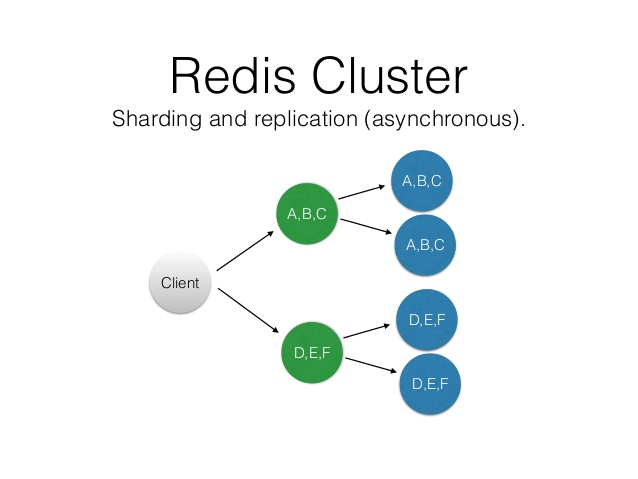
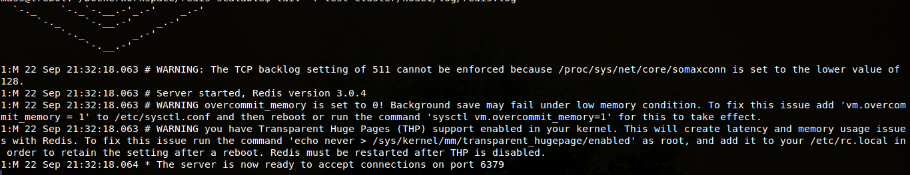
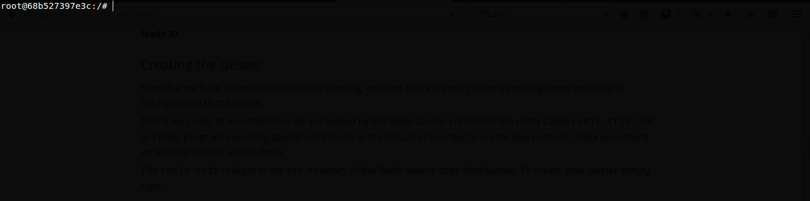
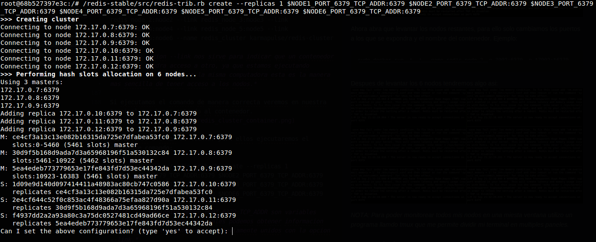
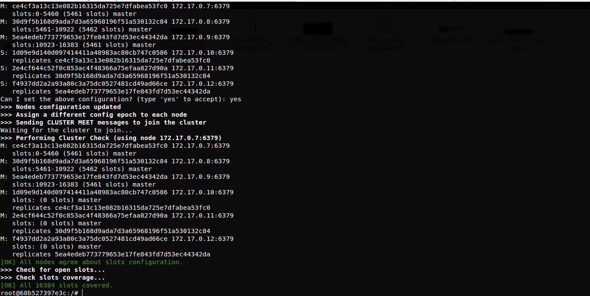
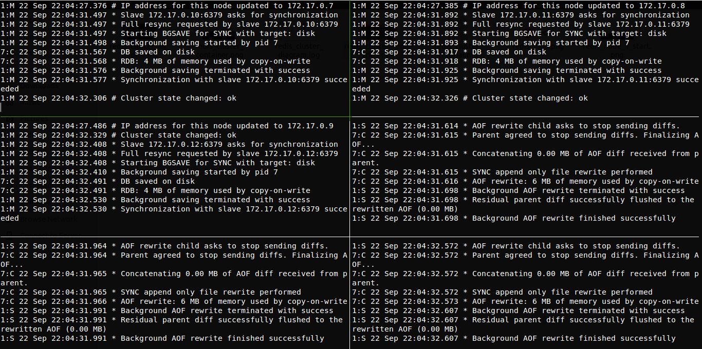
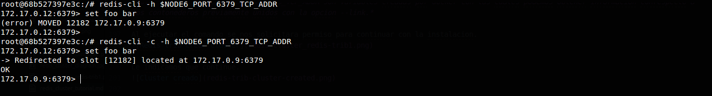
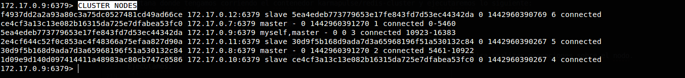

# Redis Cluster

Este documento tiene como objetivo servir como una introducción a Redis Cluster, y a su vez como un manual en la creación de un cluster de Redis usando docker.

## Temario

- Introducción al particionamiento con Redis y Redis Cluster.
- Creación de un cluster con redis y docker.

## Introducción al particionamiento con Redis y Redis Cluster.

Particionamiento es el proceso mediante el cual separamos la información dentro de múltiples instancias de Redis, de esta manera cada instancia solo tiene un subconjunto de la información.

El paticionamiento en Redis tiene dos objetivos:

- Permitir bases de datos mas grandes, utilizando la suma de memoria de muchos ordenadores.
- Permitir escalar los recursos computacionales a varios equipos.

Para tener un entendimiento mas claro del concepto de particionamiento vamos a revisar los siguientes ejemplos.

Para este ejemplo vamos a imaginar que tenemos 4 instancias de Redis R0, R1, R2, R3 y muchas llaves representando usuarios tales como: user:1, user:2 ... etcétera, existen distintas maneras para seleccionar en que instancia se almacenara cada llave.

El **particionamiento por rangos** es una de las maneras mas simples para realizar particionamiento y se logra al mapear rangos de objetos dentro de instancias especificas de Redis.
Por ejemplo, podemos decir de usuarios con el id de 0 a 10000 se almacenaran dentro de la instancia R0, mientras que usuarios con id's de 10001 al 20000 iran en la instancia R1.

Pese a que este esquema de particionamiento funciona y es usado en practica, es poco deseable para Redis ya que requiere de una tabla que mapee los rangos, lo cual lo hace ineficiente en comparación con otras alternativas.

Una alternativa al uso del particionamiento por rangos es el **particionamiento hash**. Este esquema trabaja con cualquier llave, sin requerir de llaves en el formato object_name:, y funciona de la siguiente manera:

- Toma el nombre de la llave y usa una función de hash (ej. la función de hash crc32) para convertirlo en un numero. Por ejemplo, si la llave es "foobar", crc32(foobar) devolvería algo como 93024922.
- Utiliza una operación de modulo con este numero con la intención de convertirlo en un numero entre 0 y 3, asi este numero puede ser mapeado a alguna de mis instancias. 93024922 modulo 4 es igual a 2, asi que esta llave sera almacenada en la instancia R2.

### Redis Cluster

**Redis Cluster** es la forma preferida de obtener sharding automático y alta disponibilidad.

El armar un cluster con Redis nos proporciona una instalación donde los datos se fragmentaran automáticamente a través de distintos nodos de Redis.

Redis Cluster nos asegura un grado de alta de disponibilidad, esto significa que podemos seguir operando con el cluster cuando algun nodo falle.

Redis Cluster no utiliza hashing consistente, si no una forma diferente de sharding donde cada llave es parte de lo que llamamos un **hash slot**.

Hay 16384 hash slots en Redis Cluster, y para calcular cual es el hash slot de alguna llave, simplemente se realiza la siguiente operación CRC16(key) % 16384.

Cada nodo en un Redis Cluster es responsable de un subconjunto de hash slots, asi que por ejemplo podemos tener un cluster con 3 nodos, donde:

- Nodo A contiene hashslots de 0 a 5500.
- Nodo B contiene hashslots de 5501 a 11000.
- Nodo A contiene hashslots de 11001 a 16384.

### Modelo esclavo-maestro
A fin de permanecer disponible cuando un subconjunto de nodos maestro fallan, Redis Cluster usa un modelo de **esclavo maestro** donde todos los hash slots tienen de 1 (el maestro) a N replicas (N-1 esclavos adicionales).

En nuestro ejemplo con los nodos A, B y C si el nodo B cae el cluster no pudra continuar ya que perderíamos la información correspondiente a los hash slots en el rango de 5501 a 11000.

Para evitar esto es posible agregar esclavos a cada maestro, a modo que el cluster final quede de la siguiente manera A, B, C son nodos maestros A1, B1, C1 son nodos esclavos.

Nodo B1 replica al nodo B, si B falla el cluster promovería a B1 como el nuevo maestro y continuara operando correctamente.



## Creación de un cluster con redis y docker

### Dockerizando nodos de Redis para el cluster

En este manual se asume que ya se tiene docker instalado.

Lo primero sera dockerizar los nodos de Redis que nos servirán para armar el cluster.

- **Crear el directorio redis-node.**

- **Crear el archivo Dockerfile dentro de redis-node con lo siguiente:**

*redis-node/Dockerfile*

```
FROM ubuntu:14.04

RUN apt-get update #[1]
RUN apt-get install -y build-essential
RUN apt-get install -y tcl8.5
RUN apt-get install -y wget

RUN wget http://download.redis.io/releases/redis-stable.tar.gz
RUN tar xzf redis-stable.tar.gz
RUN cd redis-stable && make && make test && make install #[2]

COPY conf/redis.conf /conf/ #[3]
RUN mkdir -p /redis-stable/log/ #[4]

VOLUME /conf/
VOLUME /redis-stable/log/
VOLUME /redis-stable/backups/ #[5]

EXPOSE 6379 #[6]
EXPOSE 16379 #[7]

ENTRYPOINT ["redis-server", "/conf/redis.conf"] #[8]
```

Vamos a detallar el contenido del archivo:

- **[1] a [2]**: En esta seccion se descarga e instala la version estable de Redis en la imagen.
- **[3]**: Se agrega el archivo de configuración especialmente editado para funcionar con Redis Cluster en la imagen.
- **[4] a [5]**: Se crean y exponen los directorios de backup y loggeo de Redis, para permitir su administracion fuera del contenedor.
- **[6] a [7]**: Se exponen los puertos necesarios para la comunicación con Redis, 6379 para comunicación directa con el servidor y 16379 para comunicación entre nodos del cluster. Para mas información leer la sección
Redis Cluster TCP ports del tutorial de [Redis Cluster](http://redis.io/topics/cluster-tutorial).
- **[8]**: Indicamos que nuestro contenedor ejecutara el comando redis-server usando el archivo de configuración /conf/redis.conf el cual se agrego previamente a la imagen.

- **Ahora agregamos el archivo de configuración de redis, lo ubicaremos en redis-node/config/redis.conf.
El archivo lo puedes obtener (aquí)[https://github.com/MarcAndTony/redis-node/blob/master/conf/redis.conf].**

-
**Ya que tenemos todo lo necesario podemos crear nuestra imagen, para
eso ejecutaremos el siguiente comando ubicados dentro de la carpeta redis-node:**
```
sudo docker build -t karmapulse/redis-node .
```

### Dockerizando las herramientas de Redis Cluster

*NOTA: Para este paso es necesario tener creada la imagen karmapulse/redis-node cuyo procedimiento de creación se ve en el paso anterior (Dockerizando nodos de Redis para el cluster).*

- **Crear el directorio redis-cluster.**

- **Crear el archivo Dockerfile dentro de redis-cluster con lo siguiente:**

*redis-node/Dockerfile*
```
FROM karmapulse/redis-node #[1]

RUN apt-get install -y ruby-full#[2]
RUN gem install redis#[3]

ENTRYPOINT ["/bin/bash"]#[4]
```
Es un archivo muy simple, vamos a revisar su composición:

- **[1]**: Se indica que se utilizara la imagen karmapulse/redis-node como base para la nueva imagen.
- **[2] a [3]**: Se instalan las herramientas necesarias para ejecutar las herramientas de Redis Cluster.
- **[4]**: Debido a que este contenedor lo usaremos solo cuando lo necesitemos solo ejecutara /bin/bash el cual posteriormente podremos controlar desde nuestra terminal.

- Esto es todo, ahora podemos proseguir a crear nuestra imagen, nos ubicamos dentro de la carpeta redis-cluster, y ejecutamos:
```
sudo docker build -t karmapulse/redis-cluster .
```

### Correr los nodos de cluster

Ya que usamos docker la tarea sera muy sencilla, solo deberemos levantar seis contenedores de la imagen karmapulse/redis-node.

Redis Cluster requiere como mínimo 3 nodos maestros para poder funcionar, para este ejemplo levantaremos 3 nodos maestros cada uno con su nodo esclavo.

Para realizar seguimiento en el comportamiento de cada uno de los nodos es recomendable ejecutar estos comando en una terminal propia.
```
sudo docker run -t -i --name redis_node_1 -p 7001:6379 -p 17001:16379 -v --restart=always karmapulse/redis-node
```
Este comando creada solo 1 nodo con el nombre redis_node_1 y expondra los puertos del contenedor a los puerto 7001 y 17001 del host en este caso nuestra computadora. Debes ver algo parecido a la siguiente imagen:


Ahora abra que levantar los nodos restantes, para ello solo cambiamos los puertos a los que se expondrá y el nombre del contenedor. Ejemplo:
```
sudo docker run -t -i --name redis_node_2 -p 7002:6379 -p 17002:16379 -v --restart=always karmapulse/redis-node
```
Después de levantar los 6 nodos tendremos algo asi:


*NOTA: Para poder monitorear todos los nodos en una misma ventana se puede usar el programa tmux que permite dividir una terminal en múltiples paneles.*

### Crear el cluster

Hasta el momento hemos logrado levantar 6 instancias de redis las cuales usaremos como nodos para el cluster, hasta ahora no existe ningún tipo de comunicación entre las instancias.

Para lograr que las instancias puedan comunicarse necesitaremos usar la utilidad de Redis Cluster llamada redis-trib.

Primero necesitamos crear un contenedor de la imagen karmapulse/redis-cluster para ello ejecutaremos el siguiente comando.

```
sudo docker run -t -i --link redis_node_1:node1 --link redis_node_2:node2 --link redis_node_3:node3 --link redis_node_4:node4 --link redis_node_5:node5 --link redis_node_6:node6 --name redis_cluster karmapulse/redis-cluster
```
*NOTA: la opción --link nos sirve para indicar que un contenedor de docker tendra
acceso a otro, ya que estamos ejecutando nuestros contenedores en la
misma computadora esta es la manera mas sencilla de tener acceso a los
nodos.*

Si ejecutamos el comando de manera correcta veremos en nuestra terminal que hemos entrado al contenedor.


Ahora vamos a crear el cluster para ellos ejecutaremos el siguiente comando:
```
/redis-stable/src/redis-trib.rb create
--replicas 1 $NODE1_PORT_6379_TCP_ADDR:6379
$NODE2_PORT_6379_TCP_ADDR:6379 $NODE3_PORT_6379_TCP_ADDR:6379
$NODE4_PORT_6379_TCP_ADDR:6379 $NODE5_PORT_6379_TCP_ADDR:6379
$NODE6_PORT_6379_TCP_ADDR:6379
```
*NOTA: las variables NODEn_PORT_6379_TCP_ADDR son variables creadas por docker con las cuales podemos obtener información con respecto a los contenedores previamente unidos con la opción --link.*

Al ejecutar el comando se nos solicitara permiso para continuar con la instalación.


Le indicamos que continúe.


Para confirmar la creación del cluster los nodos deben lucir de la siguiente manera:


Entre otras cosas podemos notar el mensaje de confirmación Cluster state changed: ok y Synchronization with slave x.x.x.x:6379 succeeded.

Nuestro cluster esta instalado y listo para ser probado.

### Probando el cluster

Nuestra primera forma para probar que el cluster este funcionando, sera por medio de la herramienta redis-cli por lo que abriremos la ventana donde tengamos corriendo el contenedor karmapulse/redis-cluster y ejecutaremos lo siguiente:
```
redis-cli -c -h $NODE1_PORT_6379_TCP_ADDR
```

Esto nos llevara al cliente de redis conectadonos al nodo indicado, lo cual nos permitida realizar operaciones sobre el nodo.
Ejecutamos:
```
set foo bar
```
El nodo re ubicara esta llave en su nodo correspondiente.


Podemos confirmar la configuración del cluster con el siguiente comando:
```
CLUSTER NODES
```
Eso devolvera información sobre todos los nodos, si son maestros y quienes son sus esclavos.


Listo ahora tenemos un cluster con Redis listo para ser probado, para usar Redis Cluster es necesario usar un cliente que lo permita para ello se puede consultar y buscar uno [aquí](http://redis.io/clients).

## Fuentes
- http://redis.io/topics/partitioning
- http://redis.io/topics/cluster-tutorial
