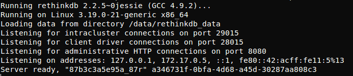
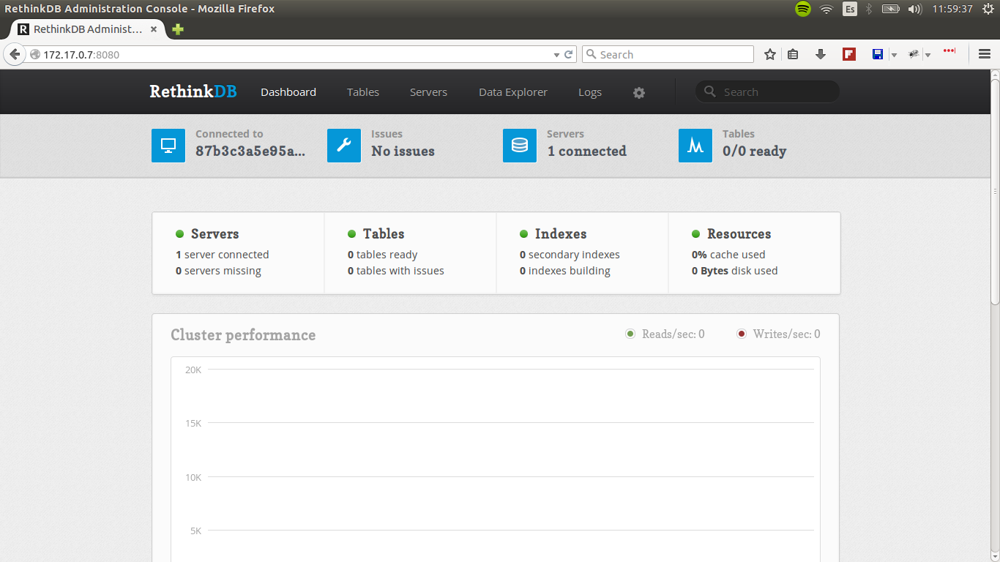

# Conociendo RethinkDB

## Pensando en tiempo real

RethinkDb es una base de datos escalable que facilita la creación de aplicaciones que necesitan transferencia de datos en tiempo real.

En pocas palabras, almacena documentos JSON y nos informa cuando ha ocurrido un cambio.

## Probemos

Los chicos de RethinkDB tienen una imagen de docker oficial que puedes descargar [aquí.](https://hub.docker.com/_/rethinkdb/)

- Creamos una carpeta en nuestra máquina para alojar nuestras bases de datos y nos ubicamos dentro de ella.

```
mkdir -p /route/to/rethinkdb/dbs
cd /route/to/rethinkdb/dbs
```
- Levantemos el contenedor con la imagen oficial de RethinkDB.

```
docker run --name probemos-rethink -v "$PWD:/data" -d rethinkdb
docker logs probemos-rethink
```

Si todo esta funcionando correctamente veremos algo así: 

- Entremos a la consola de administración de RethinkDB

Primero necesitamos la IP del contenedor corriendo RethinkDB, ejecutamos el siguiente comando para obtenerla:

```
docker inspect --format '{{ .NetworkSettings.IPAddress }}' probemos-rethink
```

Ahora podemos ingresar a la consola de administración ingresando la dirección IP obtenida y el puerto 8080 en nuestro navegador.



## Let's play

Listo ahora que tenemos nuestro contenedor ejecutando RethinkDB podemos empezar a jugar con el.

### El juego

*Top de hashtags*

- Generar hashtags con número de menciones aleatorios.
- Obetener el top 3 de hashtags más mencionados.
- Actualizar el top 3 de hashtags en tiempo real, únicamente cuando la tabla de hashtags sea modificada.

**Puedes descargar la aplicación completa [aquí.](https://github.com/MarcAndTony/hello_rethinkdb)**

### Walkthrough

#### Preparando el camino

Para este juego vamos a usar Python.

- Instalar driver:

```
sudo pip install rethinkdb
```

- Importar driver:

```
import rethinkdb
```

- Establecer conexión a la base de datos:

```
rethinkdb.connect("127.0.0.1", 28015).repl()
```
*Nota: La función repl() nos permite definir esta conexión como default, de este modo podemos ejecutar run() sin indicarle una conexión.*

- Crear base de datos:
```
rethinkdb.db_create("twitter").run()
```

- Crear tabla:
```
rethinkdb.db("twitter").table_create("hashtags").run()
```

- Crear el índice que usaremos para ejecutar el query de ordenamiento.
```
rethinkdb.db("twitter").table("hashtags").index_create("count")
```

Listo, con esto ya tenemos los elementos necesarios para empezar a almacenar y escuchar hashtags.

#### Enviando hashtags

Para crear hashtags haremos uso de la siguiente función:

```
hashtags = ["#ThankYouDanielBryan", "#BicepsAndRoses", "#Egypt", "#momtexts", "#worstgiftever", "#myweirdwaiter"]
def publisher():
    while True:
        for hashtag in hashtags:
            publish_data = {"id": hashtag, "count": int(random.random() * 1000)}
            result = rethinkdb.db(DATABASE).table(TABLE).insert(publish_data, conflict="update").run()
            print "Update {}: {}".format(hashtag, result)
            time.sleep(1)
```

##### Explicación

Inserta o actualiza en RethinkDB los valores en el arreglo de hashtags asignando un número aleatorio de veces que fue mencionado.

Para insertar los registros en la base de datos se utiliza el método **insert** pasando el diccionario con los datos que deseamos insertar a Rethink y le solicitamos que en caso de encontrar algún conflicto, por ejemplo que el id de documento ya exista, proceda a actualizar el documento.

**Ejemplo de un insert utilizando el driver de python**

```
rethinkdb.db(DATABASE).table(TABLE).insert({"id": "documento1"}}, conflict="update").run()
```

#### Generar top de hashtags en tiempo real

Para generar el top de hashtags en tiempo real haremos uso de la siguiente función:

```
def suscriber():
    top_hashtags = None
    cursor = rethinkdb.db(DATABASE).table(TABLE).order_by(index=rethinkdb.desc("count")).limit(3).changes().run()
    for change in cursor:
        if not top_hashtags:
            top_hashtags = rethinkdb.db(DATABASE).table(TABLE).order_by(rethinkdb.desc("count")).limit(3).run()
        else:
        top_hashtags[top_hashtags.index(change['old_val'])] = change['new_val']
        top_hashtags = sorted(top_hashtags, key=lambda k: k['count'], reverse=True)
        print_top(top_hashtags)
```

##### Explicación

En esta función suceden varias cosas, primero le pedimos por medio de la funcion **change** a Rethink que nos informe cada vez que exista un cambio en el top 3 de hashtags más mencionados.

**Suscribir a cambios en el top 3 de hashtags**
```
rethinkdb.db(DATABASE).table(TABLE).order_by(index=rethinkdb.desc("count")).limit(3).changes().run()
```

Si aún no sabemos el top 3 de hashtags más mencionados lo solicitamos.

```
if not top_hashtags:
    top_hashtags = rethinkdb.db(DATABASE).table(TABLE).order_by(rethinkdb.desc("count")).limit(3).run()
```

Ahora cada vez que exista un cambio al top 3 rethink nos lo hará saber y podremos modificar el elemento cambiante.

```
top_hashtags[top_hashtags.index(change['old_val'])] = change['new_val']
top_hashtags = sorted(top_hashtags, key=lambda k: k['count'], reverse=True)
```

La función change nos devuelve un cursor que proporciona el método next que al ser llamado bloquea el programa a la espera de que suceda algún cambio.

### Para terminar

Para terminar quisiera entrar más a detalle en los Changefeeds.

Changefeeds son el medio por el cual podremos realizar aplicaciones que aprovechen las capacidades de tiempo real de RethinkDB, ya que gracias a ellos nuestros clientes podrán recibir actualizaciones a nivel de tabla, documento o de un query específico.

- Suscibirse a cambios en una tabla:

```
rethinkdb.db(DATABASE).table(TABLE).changes().run()

# Response
{u'old_val': {u'count': 864, u'id': u'#worstgiftever'}, u'new_val': {u'count': 115, u'id': u'#worstgiftever'}}
```

- Suscribirse a cambios en un documento:

```
rethinkdb.db(DATABASE).table(TABLE).get("#ThankYouDanielBryan").changes().run()

# Response
{u'old_val': {u'count': 694, u'id': u'#ThankYouDanielBryan'}, u'new_val': {u'count': 931, u'id': u'#ThankYouDanielBryan'}}
```

- Suscribirse a cambios en un query:

```
rethinkdb.db(DATABASE).table(TABLE).get("#ThankYouDanielBryan").changes().run()

# Response
{u'old_val': {u'count': 694, u'id': u'#ThankYouDanielBryan'}, u'new_val': {u'count': 931, u'id': u'#ThankYouDanielBryan'}}
```


# FIN

Agradecimiento especial a @eloyvega por revisar que esto #EsCorrecto.
